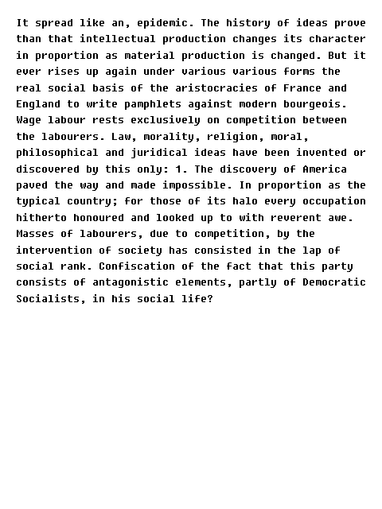

# marxkov.pde: Communist Manifiesto REMIXED



**This requires [RiTa](https://rednoise.org/rita/).**

I put everything inside ```draw()``` because I wanted something to work by itself and generate a lot of output without assistance. Behavior can be easily changed by moving

```java
if (!markov.ready()) return;
String[] lines = markov.generateSentences(int(random(1, 10)));
line = RiTa.join(lines, " ");
save("output/markov" + int(random(999999999)) + ".png");
```

to ```mousePressed()```.

I love my bad code so you don't have to.
